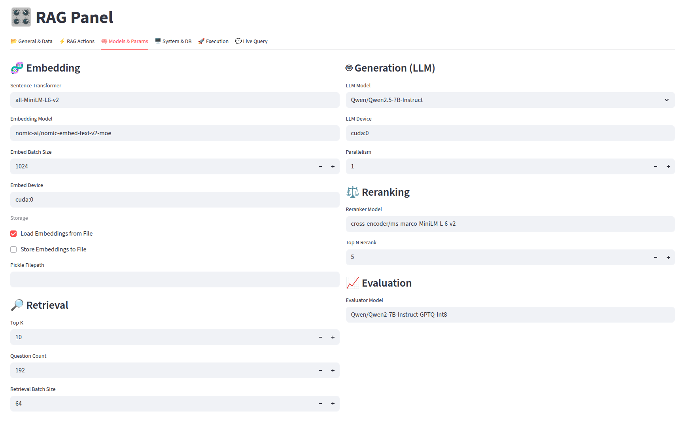
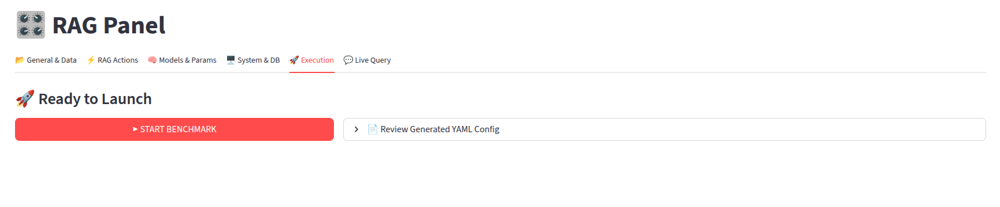

# RAGPerf: An End-to-End Benchmarking Framework for Retrieval-Augmented Generation Systems <!-- omit from toc -->

**RAGPerf** is an open-source framework designed to benchmark the end-to-end system performance of Retrieval-Augmented Generation (RAG) applications. Built with a fully modular architecture, it offers a user-friendly and highly customizable framework that allows precise measurement of throughput, latency, and scalability across different RAG configurations.

<!-- CI/CD Status -->
[](https://github.com/platformxlab/RAGPerf/actions/workflows/clang-format.yml)
[](https://github.com/platformxlab/RAGPerf/actions/workflows/black-format.yml)

<!-- Repo Characteristics -->


[](resource/clang_format/.clang-format)
[](resource/black_format/.black-format)

## Key Features

**🚀 Holistic System-Centric Benchmarking**: RAGPerf moves beyond simple accuracy metrics to profile the performance of RAG systems. It measures end-to-end throughput (QPS), latency breakdowns, and hardware efficiency. This helps developers identify potential bottlenecks throughout the entire pipeline.

**🧩 Modular Architecture**: RAGPerf uses a modular design that abstracts different stages of the RAG pipeline (Embedding, Vector Database, Reranking, and Generation) behind uniform interfaces. Users can seamlessly switch components (e.g., switching underlyinig vector database from Milvus to LanceDB, or change underlying generative model from ChatGPT to Qwen) without rewriting code. This enables detailed performance comparisons between different pipelines.

**📊 Detailed Full-Stack Profiling**: RAGPerf integrates a lightweight system profiler that runs as a background daemon. It captures fine-grained hardware metrics with minimal overhead, including GPU/CPU utilization, memory consumptions (host RAM & GPU VRAM), PCIe throughput, and disk I/O utilization. This allows detailed analysis of resource utilization between RAG components and help finding potential contention issues.

**🔄 Simulating Real-World Scenarios**: RAGPerf is able to simulate the evolution of real-world knowledge bases by synthesizing updates with a custom and configurable workload generator. The workload generator supports generating insert, update, and delete requests at different frequency and patterns, allowing users to estimate how data freshness and overall system performance varies in real systems.

**🖼️ Multi-Modal Capabilities**: RAGPerf supports diverse data modalities beyond plain text. It provides specialized pipelines including Visual RAG (PDFs, Images) using OCR or ColPali visual embeddings, and Audio RAG using ASR models like Whisper. This enables benchmarking of complex, unstructured RAG pipelines.

---

<!-- omit from toc -->
## Table of Contents

- [Key Features](#key-features)
- [Installation](#installation)
  - [Create a Virtual Environment](#create-a-virtual-environment)
  - [Install Dependencies](#install-dependencies)
  - [Install Monitoring System](#install-monitoring-system)
    - [C++ 20 Compatible Compiler Installation](#c-20-compatible-compiler-installation)
    - [Protobuf Installation](#protobuf-installation)
    - [Build MSys Shared Library and Position the Output Product to `src/monitoring_sys`](#build-msys-shared-library-and-position-the-output-product-to-srcmonitoring_sys)
- [Running RAGPerf](#running-ragperf)
  - [Quick Start with Web UI](#quick-start-with-web-ui)
    - [Preparation](#preparation)
    - [Configuring the Benchmark](#configuring-the-benchmark)
    - [Running the Benchmark](#running-the-benchmark)
  - [Run with Command Line Interface](#run-with-command-line-interface)
    - [Preparation](#preparation-1)
    - [Running the Benchmark](#running-the-benchmark-1)
    - [Performing Analysis](#performing-analysis)
- [Supported RAG Pipeline Modules](#supported-rag-pipeline-modules)
  - [Vector Databases](#vector-databases)
  - [Monitoring System](#monitoring-system)

## Installation

### Create a Virtual Environment

To run RAGPerf, we highly recommend using an isolated Python environment using a Python virtual environment manager (e.g., `venv`, `conda`) to avoid package conflicts, we use `conda` for demonstrating purposes throughout the documentation.

**Conda (recommended)**
```bash
# Install Miniconda/Mambaforge from the official site if you don't have Conda
conda create -n RAGPerf python=3.10
conda activate RAGPerf
```

### Install Dependencies

Execute the following instructions to install all the dependencies for the project.
We use `pip-tools` to ensure reproducible dependency resolution.

```bash
# install pip-compile for python package dependency resolution
python3 -m pip install pip-tools

# generate list of all required python packages
mkdir build && cd build
cmake ..
make generate_py3_requirements

# install the dependencies
python3 -m pip install -r ../requirement.txt
```

### Install Monitoring System

<!-- REVIEW: Put installation instructions here instead of readme in monitoring system module -->
RAGPerf uses a custom, low-overhead monitoring daemon. Here is a stripped down version of installation procedures (please refer to [MonitoringSystem README](monitoring_sys/README.md) for more detailed instructions and explanations).

#### C++ 20 Compatible Compiler Installation

Install a C++ 20 compatible compiler in the virtual environment. For example, to install `gcc=12.1.0`, run

```bash
conda install -c conda-forge gcc=12.1.0
```

#### Protobuf Installation

Install protobuf compiler and runtime library (modified from [PROTOBUF_CMAKE](https://github.com/protocolbuffers/protobuf/blob/main/cmake/README.md)). Currently, we are using version `v30.2`.

```bash
# clone the protobuf repository somewhere
git clone https://github.com/protocolbuffers/protobuf.git
cd protobuf
# init and switch to desired version
git submodule update --init --recursive
git checkout v30.2
# make & install to ~/.local
mkdir build && cd build
cmake .. -DCMAKE_POSITION_INDEPENDENT_CODE=ON \
         -DBUILD_SHARED_LIBS=ON \
         -Dprotobuf_BUILD_SHARED_LIBS=ON \
         -Dprotobuf_BUILD_TESTS=OFF \
         -DCMAKE_CXX_STANDARD=17 \
         -DCMAKE_BUILD_TYPE=Release \
         -DCMAKE_INSTALL_PREFIX="$HOME/.local"
cmake --build . --config Release -j
make install -j
```

#### Build MSys Shared Library and Position the Output Product to `src/monitoring_sys`

Run the following commands in the project's build folder.

```bash
# enter the python virtual environment
cmake -DCMAKE_BUILD_TYPE=Release ..
make libmsys_pymod -j
```

Make sure you see the file `libmsys.cpython-310-x86_64-linux-gnu.so` (the exact name could depend on your python version and architecture), that is the *cpython* module for the monitoring system executable.

## Running RAGPerf

RAGPerf provides an Interactive Web UI for ease of use. Or you can use the Command Line (CLI) for automation.

### Quick Start with Web UI

#### Preparation

Set these once in your shell rc file (e.g., `~/.bashrc` or `~/.zshrc`) or export them in every new shell.

```bash
# Make local "src" importable
export PYTHONPATH="$REPO_ROOT/src${PYTHONPATH+:$PYTHONPATH}"

# Where to cache Hugging Face models (optional, adjust path as needed)
export HF_HOME="/mnt/data/hf_home"
```

Install streamlit and run the RAGPerf client.

```bash
# install streamlit
python3 -m pip install streamlit
# run RAGPerf
streamlit run ui_client.py
```

Open the UI with the reported url in your web browser, the default url is `http://localhost:8501`.

#### Configuring the Benchmark

To run the benchmark, we first need to set up the vector database (See [vectordb](#vectordb) for more details). Then, customize your own workload settings with all the available options on the webpage.



#### Running the Benchmark

In the execute page, click the `START BENCHMARK` button to execute the workload already configured. You may also want to check if all the configs are set correctly, see [here](./config/README.md) for the detailed explanation for different entries in the config file.



### Run with Command Line Interface

#### Preparation

Set these environment variables once in your shell rc file (e.g., `~/.bashrc` or `~/.zshrc`) or export them in every new shell.

```bash
# Make local `src` module importable
export PYTHONPATH="$REPO_ROOT/src${PYTHONPATH+:$PYTHONPATH}"

# Where to cache Hugging Face models (optional, adjust path as needed)
export HF_HOME="/mnt/data/hf_home"
```

#### Running the Benchmark

To run the benchmark, you first need to set up the vector database as the retriever. See [vectordb](#vectordb) for a supported list and quick setup guide. Change the db_path to your local vector database storage path in config file.

```yaml
vector_db:
    db_path: /mnt/data/vectordb
```

First run the **preprocess/insert** phase to insert the dataset:

```bash
# 1) Build/insert into the vector store (LanceDB example)
python3 src/run_new.py \
  --config config/lance_insert.yaml \
  --msys-config config/monitor/example_config.yaml
```

After the insertion stage, proceed to the **query/evaluate** stage. Run the following:

```bash
# 2) Retrieval and Query
python3 src/run_new.py \
  --config config/lance_query.yaml \
  --msys-config config/monitor/example_config.yaml
```

To customize your own workload setting, you may reference the provided config file within `./config` folder. The detailed parameters are listed [here](config/README.md).

#### Performing Analysis

You can check the output result within the `./output` folder. To visualize the output results, run `python3 example/monitoring_sys_lib/test_parser.py`, the visualized figures will be located within the `./output`.

## Supported RAG Pipeline Modules

### Vector Databases

RAGPerf already integrates with many popular vector databases. To set up, check the detailed documentations at [VectorDB README](src/vectordb/README.md).

Want to add a new DB? Check our RAGPerf API at [VectorDB API](src/vectordb/README.md#adding-a-new-vector-database). This benchmark suit can automatically perform profiling and analysis on your desired vector database after implementing these APIs.

### Monitoring System

Examples of how to use it are documented in `example/monitoring_sys_lib`. Detailed documentations at [MonitoringSystem README](monitoring_sys/README.md).
